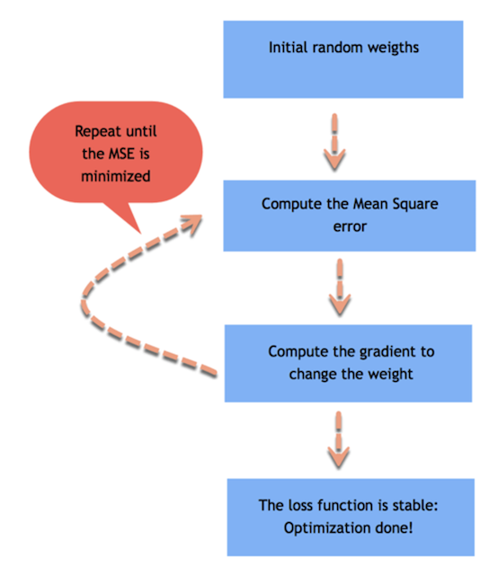

# PyTorch Analysis

**Pytorch neural network data analysis process:**




```python

x2 = []
z = 0
for i in range(0, len(data)):
    datax = data[i]

    d = pd.read_csv(
        datax, usecols=['w', 'h'])
    res = pd.read_csv(
        datax, usecols=['xmin', 'ymin', 'xmax', 'ymax'])

    x = d
    y = res

    x, y = np.array(x), np.array(y)
    model = LinearRegression().fit(x, y)

    xz = [x_new[z]]
    y_new = model.predict(xz)
    x2.append(y_new)
    z = z +1

x2 = np.array(x2)
x2.shape = 14, 4
dx = pd.DataFrame(x2)
dx.to_csv('xnew2.csv', index=False)

reg1()
x_new = pd.read_csv("xnew.csv")
x_new2 = pd.read_csv("xnew2.csv")

merged = x_new.merge(x_new2, left_index=True,right_index=True)
merged.to_csv("output.csv",index = False)

output = pd.read_csv("output.csv").values
output = pd.DataFrame(output, columns = ['width','height','xmin', 'ymin', 'xmax', 'ymax'])
print(output)

reg()
```


# Image Display

## Linear Regression Image


