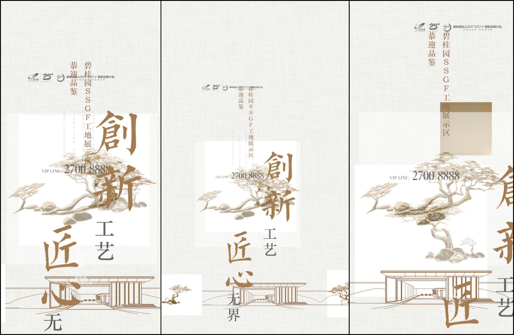

Analysis of Image Layer Data consisted of using Linear Regression Algorithms. Similar
algorithms were also used to compare results and accuracy.

# Regression Flowchart


# Types of Regression Algorithms used    

1. [Linear Regression](Regression/aLinearRegression)
2. [Bayesian Ridge](Regression/bbayesian)
3. [Huber Regressor](Regression/chuber)
4. [RANSACR Regressors](Regression/chuber)
5. [TheilSen Regressor](Regression/chuber)
6. [Elastic Net](Regression/delasticnet)
7. [ARDRegression](Regression/eArdregression)
8. [KernelRidge](Regression/fkernelridge)
9. [DecisionTreeRegressor](Regression/gtrees)
10. [KNeighbors Regressor](Regression/gtrees)
11. [Random Forest Regressor](Regression/gtrees)
12. [PyTorch](Regression/hpytorch)
13. [XGBoost](Regression/ixgboost)

# Regression Image Summary

**Linear Regression &emsp;&emsp;&emsp;&emsp;&emsp;&emsp; PyTorch &emsp;&emsp;&emsp;&emsp;&emsp;&emsp;&emsp;&emsp;&emsp;&emsp;&emsp;&emsp;&emsp; XGBoost**

<br/>


# Regression Error Analysis

**Root mean square deviation (RMSE) comparison between different testing models**  <br/>
RMSE values closer to zero indicate higher accuracy by model


```markdown
| Layer # | LinerRegression | BaysianRidge | HuberRegressor | RANSCARRegressor | TheilSenRegressor | ElasticNet | ARDRegression | KernelRidge | DecisionTreeRegressor | KNeighborsRegressor | RandomForestRegressor | XGBoost | PyTorch |
|---------|-----------------|--------------|----------------|------------------|-------------------|------------|---------------|-------------|-----------------------|---------------------|-----------------------|---------|---------|
| 10      | 0.161           | 0.154        | 0.155          | 0.183            | 0.244             | 0.154      | 0.173         | 0.289       | 0.172                 | 0.098               | 0.089                 | 0.135   | 0.173   |
| 20      | 0.289           | 0.289        | 0.289          | 0.290            | 0.321             | 0.293      | 0.304         | 0.344       | 0.385                 | 0.228               | 0.194                 | 0.284   | 0.304   |
| 30      | 0.262           | 0.261        | 0.262          | 0.263            | 0.325             | 0.258      | 0.293         | 0.346       | 0.308                 | 0.183               | 0.155                 | 0.230   | 0.293   |
| 40      | 0.220           | 0.220        | 0.220          | 0.222            | 0.289             | 0.227      | 0.241         | 0.338       | 0.266                 | 0.156               | 0.134                 | 0.191   | 0.241   |
| 50      | 0.178           | 0.178        | 0.181          | 0.186            | 0.239             | 0.152      | 0.194         | 0.278       | 0.172                 | 0.108               | 0.091                 | 0.133   | 0.194   |
| 60      | 0.160           | 0.160        | 0.160          | 0.161            | 0.202             | 0.161      | 0.171         | 0.245       | 0.182                 | 0.111               | 0.097                 | 0.144   | 0.171   |
| 70      | 0.149           | 0.149        | 0.151          | 0.172            | 0.206             | 0.170      | 0.159         | 0.265       | 0.188                 | 0.104               | 0.100                 | 0.126   | 0.159   |
| 80      | 0.326           | 0.324        | 0.324          | 0.343            | 0.402             | 0.318      | 0.353         | 0.405       | 0.373                 | 0.230               | 0.194                 | 0.291   | 0.353   |
| 90      | 0.216           | 0.216        | 0.217          | 0.219            | 0.299             | 0.218      | 0.235         | 0.276       | 0.259                 | 0.159               | 0.134                 | 0.200   | 0.235   |
| 100     | 0.161           | 0.160        | 0.160          | 0.162            | 0.224             | 0.155      | 0.171         | 0.350       | 0.171                 | 0.105               | 0.089                 | 0.129   | 0.171   |
| 110     | 0.184           | 0.183        | 0.183          | 0.184            | 0.192             | 0.163      | 0.187         | 0.236       | 0.228                 | 0.142               | 0.116                 | 0.172   | 0.187   |
| 120     | 0.148           | 0.147        | 0.148          | 0.150            | 0.185             | 0.152      | 0.155         | 0.268       | 0.176                 | 0.109               | 0.093                 | 0.131   | 0.155   |
| 130     | 0.125           | 0.125        | 0.125          | 0.126            | 0.146             | 0.124      | 0.132         | 0.242       | 0.154                 | 0.090               | 0.076                 | 0.112   | 0.132   |
| 140     | 0.120           | 0.120        | 0.121          | 0.120            | 0.159             | 0.116      | 0.269         | 0.259       | 0.112                 | 0.046               | 0.052                 | 0.038   | 0.269   |

| Average | 0.193           | 0.192        | 0.193          | 0.199            | 0.245             | 0.190      | 0.217         | 0.296       | 0.225                 | 0.134               | 0.115                 | 0.165   | 0.217   |
```


# Regression Results and Summary
From the error results of the 13 regression algorithms, **RandomForestRegressor** had the lowest average RMSE value of **0.115**. The RMSE values compare the accuracy of the generated outputs with the inputted image layer data sets. This measure of accuracy does not necessarily represent the accuracy of the visual images generated.  

Visually comparing the regression algorithms reveals that many images look very similar. This is due to the fact that all input values for the regression algorithms were the same. Unfortunately most generated images do not display a visually appealing image. All of the images have image layers overlapping and some have layers either overlapping edges or completely missing. This may be due to the fact that the image generation process does not take in consideration of image boundaries and preventing multiple images layers from colliding with each other.  

Although the results of this project where unsatisfactory, this experience has helped me learn new skills and improve on others. I have gained more experience with using python through learning about the many different regression libraries in python. I have also gained front-end experience through the creation of this website using [ReactJS](https://reactjs.org/) and [Gatsby](https://www.gatsbyjs.org/). This project has helped me deepen my understanding of machine learning algorithms and provide insight into Artificial Intelligence.
